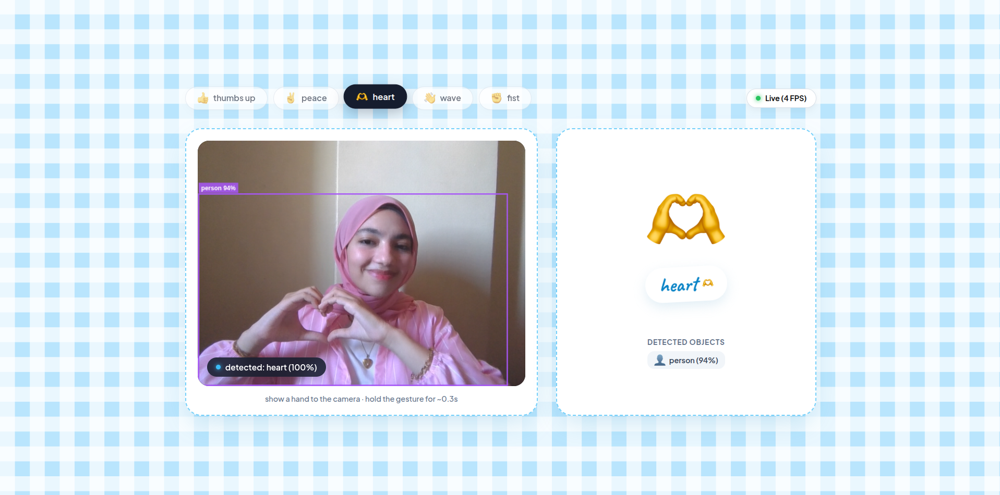
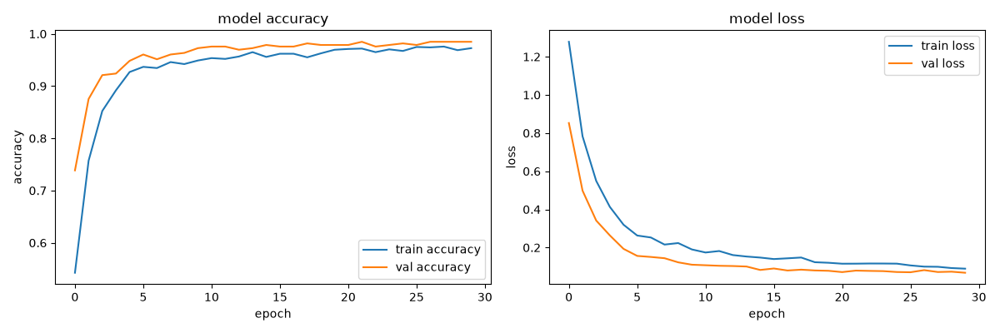

<h1 align="center">Gesture Object Vision</h1>

<p align="center">
  <b>A real-time AI computer vision system for hand gesture classification and object detection — powered by MediaPipe, TensorFlow, and YOLO11 via FastAPI WebSockets to a React dashboard.</b>
</p>

<p align="center">
  
  
  
  
  
</p>

---

## Overview

**Gesture Object Vision** keeps real-time hand gesture recognition and object tracking together in one high-performance dashboard. Live webcam frames stream continuously over a bi-directional WebSocket connection between a FastAPI backend and a React frontend. The backend extracts 21 3D hand landmarks using MediaPipe, normalizes spatial vectors, and predicts hand gestures (`thumbs_up`, `peace`, `heart`, `wave`, `fist`) using a custom pre-trained Keras neural network. Simultaneously, a concurrent YOLO11 model identifies surrounding objects and returns resolution-independent bounding boxes rendered live on HTML5 canvas overlays.

---

## Screenshots

### Web App Interface

<p align="center">
  
</p>

### Model Training & Validation Performance

<p align="center">
  
</p>

---

## Features

- **Bi-Directional WebSocket Streaming:** Real-time request-response loop (`send frame → receive inference`) eliminating frame queue buffering for zero lag.
- **MediaPipe Feature Engineering:** Extracts 21 3D hand landmarks per frame and normalizes coordinates relative to the wrist point for scale and position invariance.
- **Custom Keras Neural Network:** Classifies 5 distinct hand gesture poses (`thumbs_up`, `peace`, `heart`, `wave`, `fist`) with confidence scoring.
- **Concurrent YOLO11 Object Detection:** Detects surrounding desk and room objects (`cell phone`, `cup`, `bottle`, `laptop`, `mouse`, `keyboard`) with normalized bounding boxes.
- **Gesture Hold Stabilization (Debouncing):** Uses a rolling 6-frame history queue requiring a pose to be held for ~0.3s to prevent flickering while moving hands.

---

## Tech Stack

| Layer | Technology |
| --- | --- |
| **Frontend** | React, Vite, HTML5 Canvas, Vanilla CSS |
| **Backend** | Python, FastAPI, Uvicorn, WebSockets |
| **Machine Learning** | TensorFlow, Keras, MediaPipe, Ultralytics YOLO11 |
| **Vision Processing** | OpenCV, NumPy |

---

## System Architecture

| Component | Technology | Role |
| --- | --- | --- |
| **Feature Extractor** | MediaPipe Hands | Extracts 21 3D hand joint coordinates `(x, y, z)` per frame |
| **Gesture Classifier** | Custom Keras MLP | Processes 42 normalized spatial features to predict gesture probabilities |
| **Object Detector** | YOLO11 | Detects bounding boxes and returns normalized `[0..1]` relative coordinates |
| **Streaming Engine** | FastAPI WebSockets | Manages continuous bi-directional Base64 frame transport |
| **Dashboard UI** | React + Canvas API | Renders mirrored video feed, object overlays, and gesture stickers |

---

## Running Locally

### Prerequisites
- Python 3.11+, Node.js 18+, Webcam

### Backend

```bash
cd backend
source ../venv/bin/activate
PYTHONPATH=.. python main.py
```

### Frontend

```bash
cd frontend
npm install
npm run dev
```

App available at `http://localhost:5173`

---

## Author

**Jana Rashed** — [GitHub](https://github.com/janamirashed) · [LinkedIn](https://linkedin.com) · [Portfolio](https://janamirashed.github.io)
